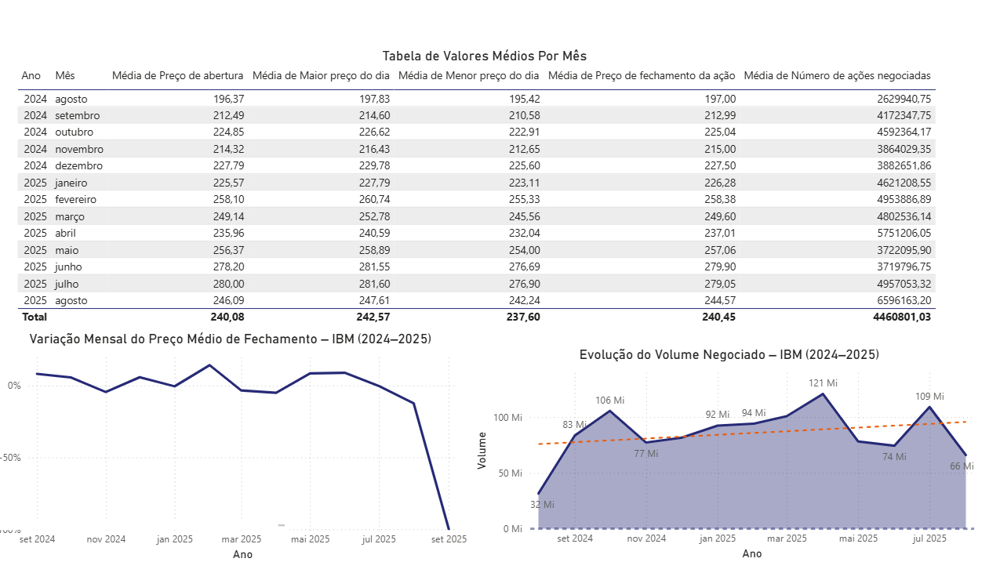

# 📈 Projeto de Análise de Ações – IBM (2024–2025)

## 🏢 Sobre a IBM

A International Business Machines Corporation (IBM) é uma das maiores empresas globais de tecnologia, com atuação em áreas como computação em nuvem, inteligência artificial, hardware, software e consultoria. Suas ações são negociadas na bolsa de valores dos Estados Unidos e acompanhadas por investidores em todo o mundo.

---

## 🎯 Objetivo da Análise

Este projeto foi desenvolvido no Power BI com o propósito de analisar a evolução mensal das ações da IBM entre agosto de 2024 e agosto de 2025. A análise contempla:

- Preços médios de abertura, fechamento, máxima e mínima diária  
- Volume médio de ações negociadas  
- Visualizações gráficas da variação de preços e do volume negociado  

📎 [Acesse o relatório completo em PDF](ibm.pdf)

---

## 📊 Visão Geral dos Dados

A tabela abaixo apresenta os valores médios mensais das ações da IBM ao longo do período analisado:

| Ano  | Mês      | Abertura | Máximo | Mínimo | Fechamento | Volume Negociado |
|------|----------|----------|--------|--------|------------|------------------|
| 2024 | Agosto   | 196,37   | 197,83 | 195,42 | 197,00     | 2.629.940         |
| 2024 | Setembro | 212,49   | 214,60 | 210,58 | 212,99     | 4.172.347         |
| 2024 | Outubro  | 224,85   | 226,62 | 222,91 | 225,04     | 4.592.364         |
| 2024 | Novembro | 214,32   | 216,43 | 212,65 | 215,00     | 3.864.029         |
| 2024 | Dezembro | 227,79   | 229,78 | 225,60 | 227,50     | 3.882.651         |
| 2025 | Janeiro  | 225,57   | 227,79 | 223,11 | 226,28     | 4.621.208         |
| 2025 | Fevereiro| 258,10   | 260,74 | 255,33 | 258,38     | 4.953.886         |
| 2025 | Março    | 249,14   | 252,78 | 245,56 | 249,60     | 4.802.536         |
| 2025 | Abril    | 235,96   | 240,59 | 232,04 | 237,01     | 5.751.206         |
| 2025 | Maio     | 256,37   | 258,89 | 254,00 | 257,06     | 3.722.095         |
| 2025 | Junho    | 278,20   | 281,55 | 276,69 | 279,90     | 3.719.796         |
| 2025 | Julho    | 280,00   | 281,60 | 276,90 | 279,05     | 4.957.053         |
| 2025 | Agosto   | 246,09   | 247,61 | 242,24 | 244,57     | 6.596.163         |

---

## 📉 Variação Mensal do Preço de Fechamento

- Crescimento expressivo entre agosto/24 (197,00) e junho/25 (279,90)  
- Pico máximo em junho/julho de 2025  
- Queda acentuada em agosto/25 para 244,57  

Este gráfico reflete a oscilação dos preços de fechamento ao longo do período, sugerindo possíveis impactos de decisões estratégicas, resultados financeiros ou eventos externos.

---

## 📈 Evolução do Volume Negociado

- Maior volume: agosto/25 (6,59 milhões de ações)  
- Menor volume: agosto/24 (2,62 milhões)  
- Tendência geral de crescimento no interesse dos investidores  

O gráfico demonstra o aumento da liquidez das ações da IBM, indicando maior participação do mercado ao longo dos meses.

---

## 🖼️ Visualização Integrada

A imagem acima reúne os principais elementos do projeto: a tabela com os valores médios por mês, o gráfico de variação do preço de fechamento e o gráfico de evolução do volume negociado. Essa visualização foi gerada diretamente no Power BI com base em dados reais.

---

## 🧠 Principais Aprendizados

Durante o desenvolvimento deste projeto, aprimorei habilidades como:

- Organização e tratamento de dados financeiros  
- Criação de visualizações interativas no Power BI  
- Interpretação de tendências de mercado com base em dados históricos  

---

## 🔜 Próximos Passos

- Implementar KPIs com DAX (preço máximo, mínimo, variação percentual)  
- Publicar o dashboard interativo no Power BI Service  
- Integrar fontes externas de dados (ex: Yahoo Finance, APIs financeiras)
